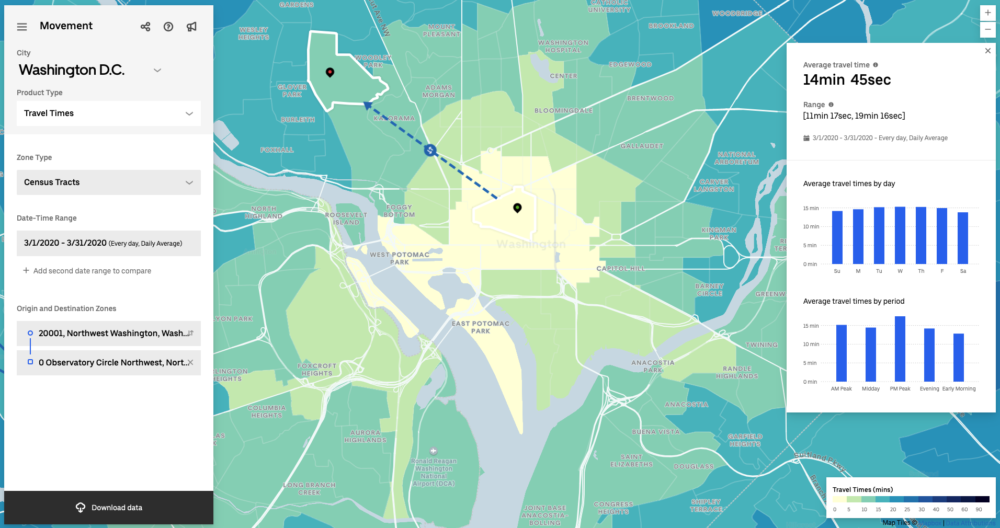
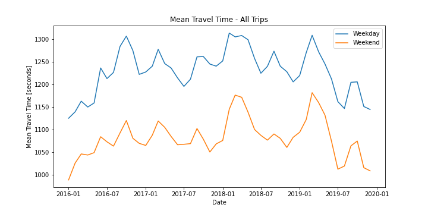
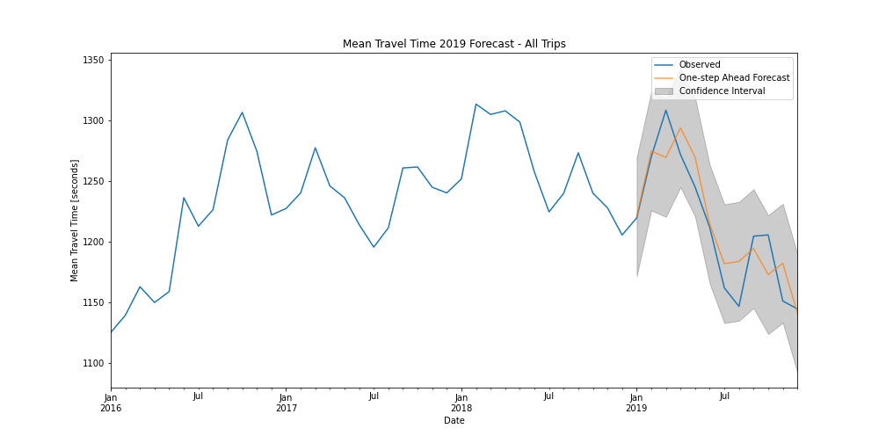
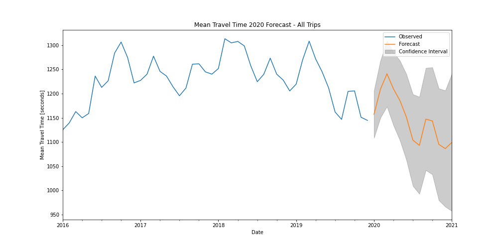

# Forecasting Uber Travel Times

#####    by <b>[Bobby Williams](https://github.com/bobbyiestofjos)</b>

---

## Repo Contents

- <b>data</b> - Various datasets used for modeling and reference.
- <b>images</b> - Various plots and images used in the documents found in this repo.
- <b>notebooks</b> - Jupyter Notebooks created for this project.
    - <b>[01_data_prep.ipynb](notebooks/01_data_prep.ipynb)</b> - Data prep...
    - <b>[02_eda.ipynb](notebooks/02_eda.ipynb)</b> - Jupyter Notebook containing Exploratory Data Analysis.
    - <b>[03_model.ipynb](notebooks/03_model.ipynb)</b> - Jupyter Notebook containing the process for creating the models.
- <b>[executive.ipynb](executive.ipynb)</b> - The main Jupyter Notebook containing the models and analysis for this project.
- <b>[presentation](presentation.pdf)</b> - The presentation for this project.
- <b>[README.md](README.md)</b> - A description of the project goals, process, and results.

---

## Uber Movement

In January of 2017 Uber introduced a website tool for urban planners to access and download their anonymized and aggregated trip data. Their intent was to help inform decisions about how to adapt existing infrastructure and invest in future solutions to make cities more efficient.

---

## Goal

Uber Movement allows site visitors to map trips between census tracts across select cities to view historical mean travel times between those tracts. Currently Uber Movement only provides historical information.

The goal of this project is to predict future travel times across Washington DC, via time series modeling, for urban planners utilizing Uber Movement, or a similar web app, for city planning.

---

## Data

Over 17 million data points across 32 csv files were pulled from the Uber Movement website. These were combined to form a single dataset which included a monthly average for Mean Travel Times from the year 2016 thru 2019 between census tract locations across Washington DC.

For this date range the granularity was limited to monthly averages broken down by weekday and weekend trips.

This plot shows the average trip time for all trips across DC by the time_of_week.

This is a plot of some of the census tracts in the DC area, outlined in red, with an example of a trip in the DC area. A trip consists of a starting tract at the tail of the green arrow and an end tract at the tip of the arrow head.

Uber Movement aggregates data by trip. There are over 31,000 trips in the dataset.

---

## Modeling

SARIMA modeling is a time series forecasting method that includes a component for data with underlying seasonality.

Due to the uniqueness of each trip across DC: trip distance, multiple route options, speed limits, etc, a separate model is needed for every trip. Over 31,000 optimized SARIMA models are available for deployment to forecast travel times.

There was a trade-off between model complexity and runtime due to processing power.

### Performance

This plot is for the average travel time of all the weekday trips across DC.

The blue line represents the actual travel times, the orange line represents travel times predicted by the model, and the gray confidence interval area is a range that, with 95% certainty, the actual mean will fall within as predicted by the model.

Multiple model iterations are produced for each trip using different parameters to minimize Root Mean Square Error, the metric used to determine model performance.

Here the Root Mean Square Error is a measure of the differences between values forecasted by the model and the observed values.

### Predictions

After determining the optimum parameters for each model, forecasts are created for the year 2020.

These forecasts will allow urban planners to quickly look at what the next year or period of time will look like across specific areas of the city.

---

## Conclusion

Implementation of the models from this project into the Uber Movement interface, or a similar web application, will allow urban planners to determine the potential impact of future city projects on forecasted travel times.

---

## Future Work

Road Construction  
- To assist with this I’ve pulled occupancy permit data for Washington DC to determine the effects certain types of planned roadway construction/congestion such as Construction Staging Areas, Parades, and City Events have on travel times.

Wider Implementation  
- The process in this project is easily scalable to additional cities for wider implementation.

Improve Modeling  
- As mentioned, the models were simplified due to processing power constraints. Addressing this will allow for more complex models providing improved forecasting.